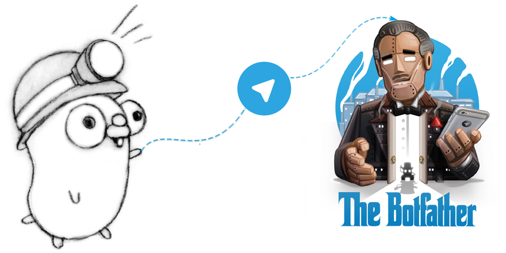
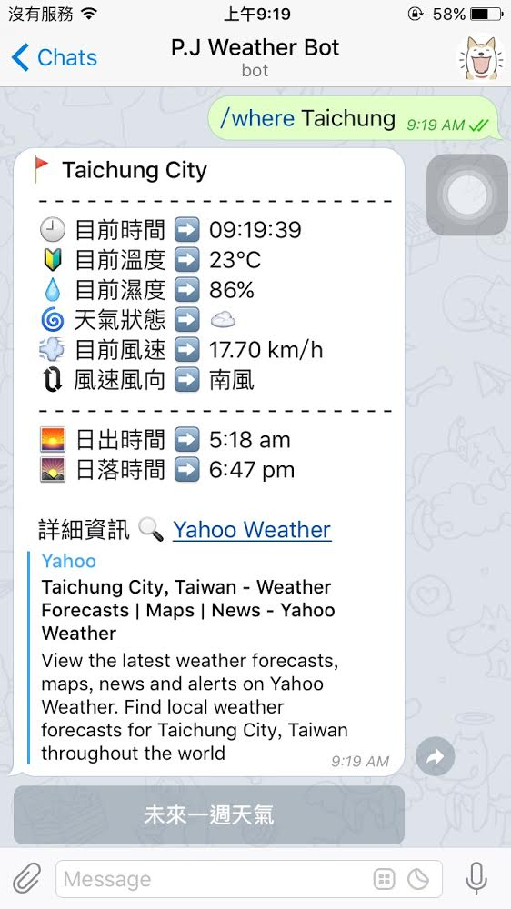

# Telegram Weather Bot (Go)

[](https://travis-ci.org/neighborhood999/go-telegram-weather-bot)
[](https://codecov.io/gh/neighborhood999/go-telegram-weather-bot)
[](https://goreportcard.com/report/github.com/neighborhood999/go-telegram-weather-bot)
[](https://github.com/neighborhood999/go-telegram-weather-bot)



> Telegram Weather Bot written in Go.

## Usage

**First, You need have telegram account!**  

Add [@BotFather](https://telegram.me/BotFather) and send `/newbot` command to make new Bot, then you will get bot token.  

After get bot token then write token into `token.json` then running:
```sh
$ go get github.com/go-telegram-bot-api/telegram-bot-api
$ go get github.com/bitly/go-simplejson

$ go run main.go utils.go weather.go
```

## Screenshot



## Test

```sh
$ go test
```

## Build

```sh
$ go build
```

## Weather API

☀️ [Yahoo Weather](https://developer.yahoo.com/weather/)

## Related

- [Telegram Bot 開發起手式](http://neighborhood999.github.io/2016/07/19/Develop-telegram-bot/)
- [Telegram Weather Bot _(Nodejs)_](https://github.com/neighborhood999/telegram-weather-bot)

## LICENSE

[Peng Jie](https://github.com/neighborhood999) © MIT
